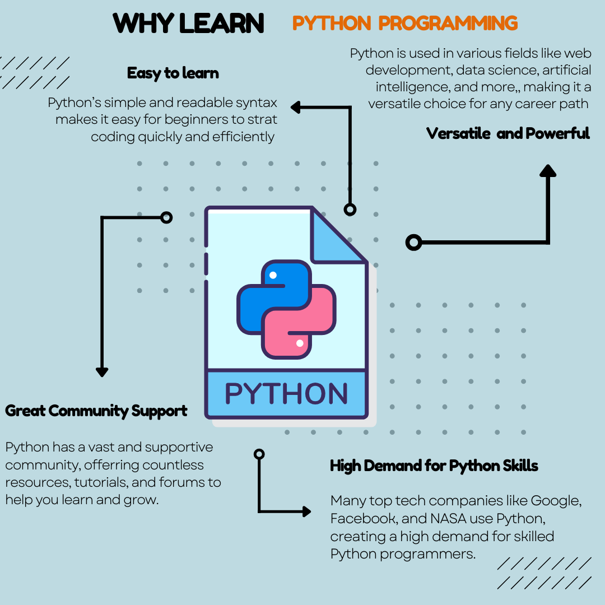

This week, I focused on creating infographics for my research paper. 
These graphics are thoughtfully crafted to make learning computer science more attractive, especially for underrepresented demographics.
They also highlight the vast possibilities of careers in computer science, aiming to inspire and engage the younger audience I’m targeting.

In addition to the visual content, I finalized the final paper count for my research paper, ensuring that all elements are aligned and comprehensive. 
This marks a significant step forward in my project, bringing me closer to the completion of my research.

Overall, this week has been productive in solidifying both the content and visual appeal of my research, making it more accessible and engaging for my intended audience.

## Infographics

{ width=60% }
