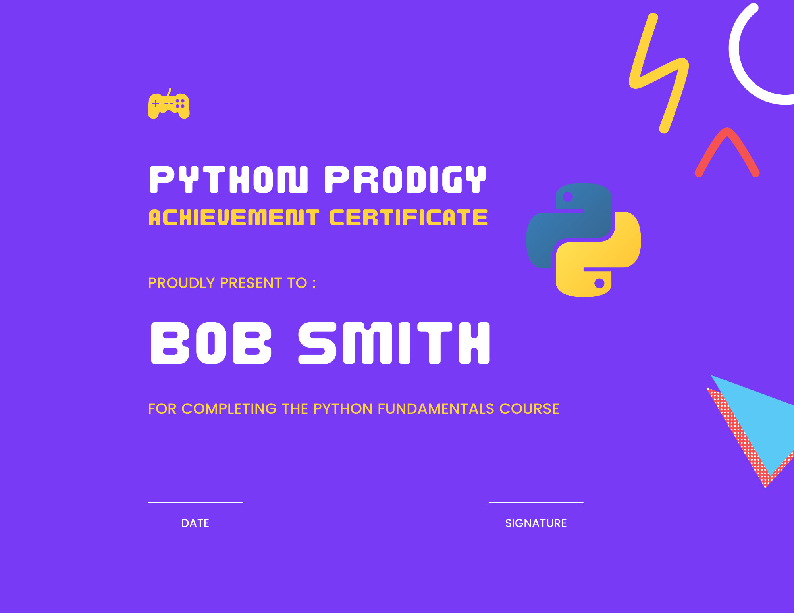

This week, I finalized my paper selection for my research project. 
After reviewing over 100 papers, I narrowed down my final selection to 11.
The criteria for this selection were focused on papers that discuss computer science education, 
particularly methods to make it attractive and accessible to both rural and inner-city demographics.

Additionally, I ensured that the content would be understandable for 8th-grade level students, which is critical for my target audience.

In addition to finalizing the paper selection, I also created an image of a certification that could be granted to students upon achieving specific milestones in their learning journey.
This certification serves as both a motivational tool and a tangible acknowledgment of their progress in mastering computer science concepts.

## Certification

